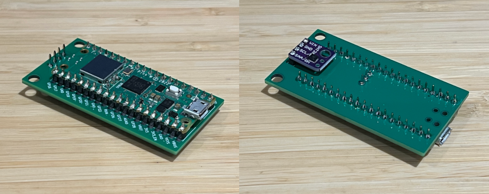

# Humidity Monitor 🚧

A Rust-based humidity monitor using a Raspberry Pi Pico W and Sensirion SHT3x sensor. This project uses the Embassy async runtime framework for efficient embedded programming.


Photo of the Pico W on the carrier board with the sensor on the back.

## Features
- Real-time humidity and temperature monitoring using a Sensirion SHT3x
- WiFi connectivity using the Raspberry Pi Pico W's built in CYW43439 chip
- JSON-based configuration

## Hardware Requirements
- Raspberry Pi Pico W
- Sensirion SHT3x
- [Carrier PCB board](./hardware/board/)

## Project Structure

```
humidity-monitor/
├── src/
│   ├── main.rs           # Main application code
│   ├── config.json       # Configuration file (you need to create this)
│   └── config.json.example # Example configuration
├── hardware/
│   └── board/           # Hardware-specific code
├── Cargo.toml           # Project dependencies and configuration
├── memory.x             # Memory layout configuration
└── build.rs            # Build script
```

## Dependencies

- [CYW43 firmware](../cyw43-firmware/) for WiFi

## Building

1. Ensure you have the Rust toolchain installed
2. Clone the repository
3. Copy `config.json.example` to `config.json` and configure your settings
4. Build the project:
   ```bash
   cargo build --release
   ```

## Running

The project is setup to use `probe-rs` to program the Pico. To flash the Pico, simply run:

```bash
cargo run --release
```